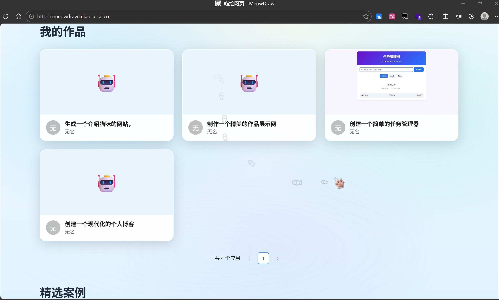

# Meow-Draw 喵绘网页
[项目已上线meowdraw.miaocaicai.cn](meowdraw.miaocaicai.cn)
## 项目技术栈

### 1. 🤖 AI 增强与工作流编排
* **核心引擎**：基于 **LangChain4j** 与 **LangGraph4j** 搭建高性能 **AI 服务**。
* **工作流治理**：
    * **Tool Calling**：实现外部工具（Tools）的自动化调用与集成。
    * **Guardrails**：构建内容**安全护栏**，确保模型输出合规与确定性。
    * **Memory & History**：实现基于 **Memory ID** 的长短期记忆与会话历史管理。
    * **Route**：利用模型意图识别实现复杂的**动态逻辑路由**。

---

### 2. 🏛️ 后端微服务核心框架
* **微服务治理**：采用 **Spring Boot** 与 **Spring Cloud** 深度集成。
    * **Nacos**：负责服务的**注册与发现**以及统一配置管理。
    * **Higress**：云原生**网关**，负责流量入口控制、安全防护与协议转换。
    * **Dubbo**：实现高性能的 **RPC** 远程服务调用。
* **消息中间件**：通过 **RabbitMQ** 实现系统异步解耦、流量削峰与消息驱动。
* **持久层框架**：使用 **MyBatis-Flex**，利用其 **Fluent API** 显著提升 SQL 编写效率与代码灵活性。

---

### 3. 💾 数据存储与多级缓存体系
* **多级缓存（Multi-Level Cache）**：
    * **L1 进程内缓存**：使用 **Caffeine** 实现本地高速缓存，极致降低网络 I/O。
    * **L2 分布式缓存**：利用 **Redis**（配合 **Redisson** 完备的分布式锁与集合）保障跨服务数据一致性。
* **存储方案**：
    * **关系型数据库**：**MySQL** 负责业务核心数据，并针对底层进行 **SQL 索引优化** 以支撑高并发。
    * **对象存储**：集成 **腾讯云 COS** 存储图片、视频及 AI 生成的静态资源。

---

### 4. 📈 运维监控与全链路追踪
* **可观测性**：集成 阿里云 **ARMS** 实现应用性能（APM）实时监控与链路追踪。
* **度量指标**：通过 **Prometheus** 采集系统各项指标，配合 **Grafana** 实现多维度**可视化看板**。

---

### 5. 🛠️ 辅助工具与技术细节
* **自动化与代理**：
    * **Selenium**：用于网页数据抓取、自动化交互或 UI 自动化测试。
    * **Nginx**：负责高性能负载均衡、反向代理及静态资源调度。
* **开发工具链**：
    * **智能开发**：深度使用 **IntelliJ IDEA** 与 **Cursor** (AI 原生编程环境) 提升编码效能。
    * **基础设施**：全量 **Docker** 容器化部署，确保开发、测试、生产环境的高一致性。

## 如何使用？
和小喵对话，让她来绘制你的前端网页，支持可视化编辑，一键部署！
### 你可以和小喵对话，表达你的需求

### 小喵会根据你的需求，进行路由选择不同的模式
包括：
1.HTML单文件模式

2.HTML+CSS+JS多文件模式

3.Vue模式

### 如果你对小喵绘制网页有更好的建议，你可以指出对应的元素并告诉小喵
小喵会根据你的修改建议，进行修改。

修改后，网页自动更新。

### 如果你觉得绘制的很不错，你可以一键部署，分享给你的朋友

### 如果你想手动修改代码，跟后端一起调试等，你还可以下载代码
### 你还可以查看你的应用，以及社区的精选应用

